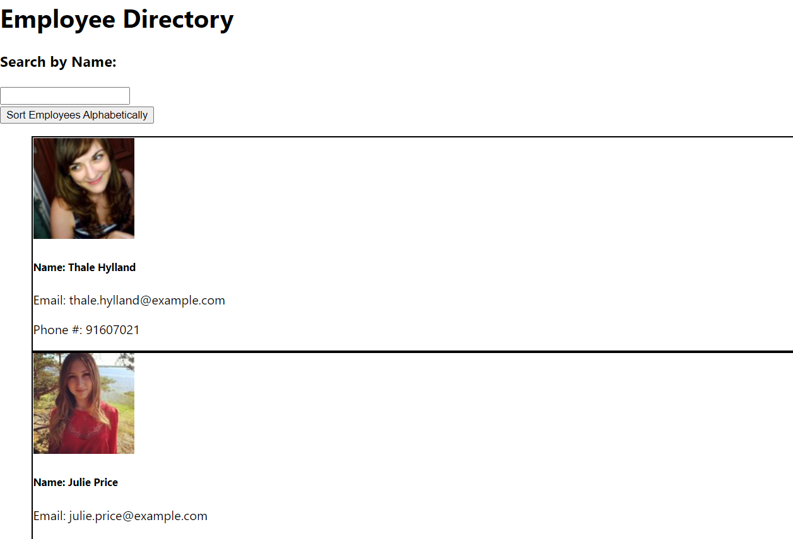
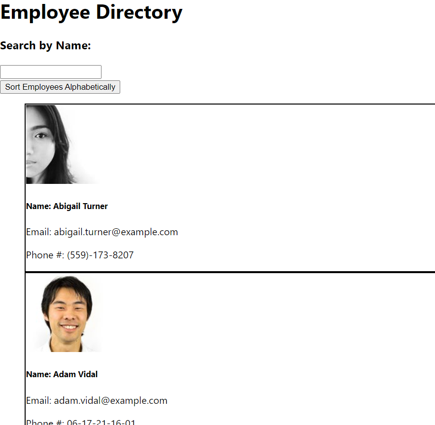
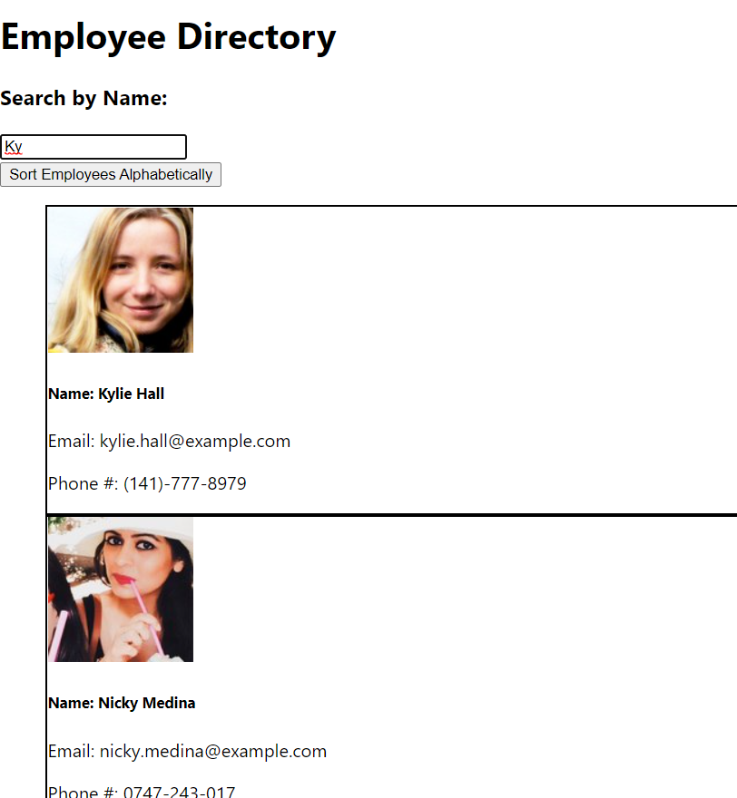

# User-Directory

## Description
This React application uses the Random User API to generate 200 fake users and populate the user directory, which can then be searched or sorted alphabetically. 

## Screenshots 

## Deployed Link
https://user-directory-bootcamp.herokuapp.com/